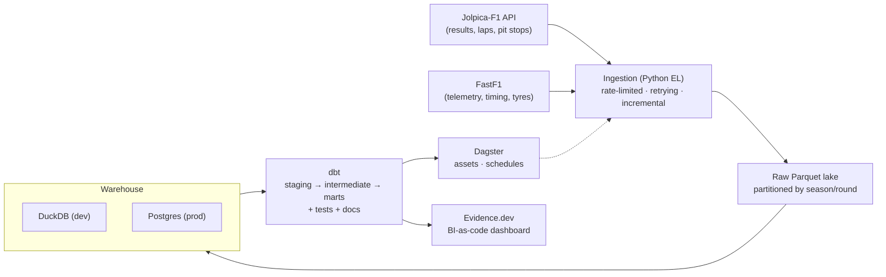

# F1 Analytics Engineering Platform

> An end-to-end **data engineering** platform for Formula 1: reliable ingestion,
> a versioned warehouse, tested transformations, orchestration, and a
> SQL-native dashboard — powering a signature insight that isolates **driver
> skill from car performance**.

[](.github/workflows/ci.yml)
[](warehouse/dbt)
[](orchestration)

---

## The signature insight — "true pace" driver ratings

Teammates drive **identical machinery**, so the gap *between teammates* isolates
driver skill from the car. Chaining these pairwise deltas across seasons yields a
single cross-era **driver-skill leaderboard** — the headline output of this
platform. (Coming in Milestone 2.)

## Architecture



## Tech stack

| Layer          | Tool                                             |
| -------------- | ------------------------------------------------ |
| Sources        | [Jolpica-F1](https://github.com/jolpica/jolpica-f1) (post-Ergast) · [FastF1](https://github.com/theOehrly/Fast-F1) |
| Ingestion      | Python, `requests`, `tenacity`, `pydantic`       |
| Lake           | Parquet (`pyarrow`)                              |
| Warehouse      | DuckDB (dev) · Postgres (prod, docker-compose)   |
| Transform      | dbt (`dbt-duckdb`, `dbt-postgres`)               |
| Orchestration  | Dagster                                          |
| Serving        | Evidence.dev                                     |
| Quality / CI   | `ruff`, `mypy`, `pytest`, `sqlfluff`, GitHub Actions |

## Quickstart

```bash
# 1. Create a 64-bit Python 3.12 virtual environment
py -3.12 -m venv .venv
.venv\Scripts\activate           # Windows PowerShell
pip install -e ".[dev]"

# 2. Configure
copy .env.example .env           # then edit as needed

# 3. Backfill a season into the local DuckDB warehouse
python -m ingestion.cli backfill --season 2023

# 4. (Optional) bring up the Postgres "prod" warehouse
docker compose up -d postgres
```

## Repository layout

```
ingestion/        Python EL package (clients, loaders, CLI)
warehouse/dbt/    dbt project (staging → intermediate → marts)
orchestration/    Dagster assets, jobs, schedules
dashboard/        Evidence.dev BI-as-code project
tests/            pytest suite
```

## Roadmap

- [x] **M1 — Foundations**: scaffold, ingestion, warehouse, CI *(in progress)*
- [ ] **M2 — dbt core**: staging/intermediate/marts + `driver_ratings` insight
- [ ] **M3 — Telemetry & serving**: FastF1 ingestion + Evidence dashboard
- [ ] **M4 — Orchestration**: Dagster assets + race-weekend schedule
- [ ] **M5 — Depth**: pit-strategy & tyre-degradation marts, writeup

## License

MIT — see [LICENSE](LICENSE). Not affiliated with Formula 1. Data via Jolpica-F1
and FastF1; F1 timing data © FOM, used here for non-commercial analysis.
