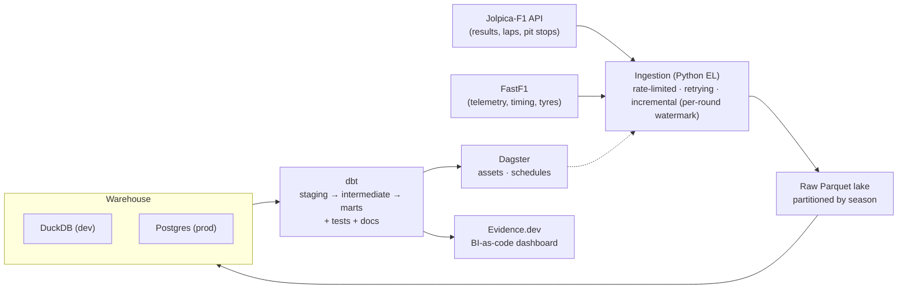

# F1 Analytics Engineering Platform

> An end-to-end **data engineering** platform for Formula 1: reliable ingestion,
> a versioned warehouse, tested transformations, orchestration, and a
> SQL-native dashboard — powering a signature insight that isolates **driver
> skill from car performance**.

[](.github/workflows/ci.yml)
[](warehouse/dbt)
[](orchestration)

---

## The signature insight — "true pace" driver ratings

Teammates drive **identical machinery**, so the qualifying gap *between teammates*
isolates driver skill from the car. Each gap is turned into an additive log-pace
difference and the whole set is solved into one cross-era leaderboard via a
Massey-style least-squares fit on the teammate graph (with empirical-Bayes
shrinkage so thin-sample drivers don't top the board on noise).

**Fastest qualifiers, 2006–2025** (teammate-normalised, drivers with ≥40 head-to-heads):

| Rank\* | Driver           | Rating | Head-to-heads | Seasons   |
| -----: | ---------------- | -----: | ------------: | --------- |
|      1 | Max Verstappen   |  0.946 |           224 | 2015–2025 |
|      4 | George Russell   |  0.641 |           149 | 2019–2025 |
|      5 | Charles Leclerc  |  0.578 |           171 | 2018–2025 |
|      6 | Daniel Ricciardo |  0.504 |           252 | 2011–2024 |
|      7 | Sebastian Vettel |  0.469 |           292 | 2007–2022 |
|      8 | Pierre Gasly     |  0.441 |           169 | 2017–2025 |
|      9 | Lando Norris     |  0.438 |           150 | 2019–2025 |
|     11 | Nico Rosberg     |  0.351 |           202 | 2006–2016 |
|     14 | Fernando Alonso  |  0.300 |           347 | 2006–2025 |
|     15 | Lewis Hamilton   |  0.295 |           376 | 2007–2025 |

\* Global rank across all 100 drivers; the gaps (2, 3, 10, …) are lower-sample
drivers omitted from this filtered view. Higher rating = faster vs teammates.
Hamilton mid-pack is a genuinely debatable result — the metric measures *margin
over teammate*, and his teammates (Alonso, Rosberg, Russell) were consistently
strong.

Reproduce:

```bash
pip install -e ".[dbt]"                                  # dbt is a separate extra (see below)
python -m ingestion.cli backfill --from 2006 --to 2025   # ~17k rows
make dbt-build                                           # staging → intermediate → marts
python -m analytics.cli ratings --top 20                 # solve + print leaderboard
```

## Architecture



## Tech stack

| Layer          | Tool                                             |
| -------------- | ------------------------------------------------ |
| Sources        | [Jolpica-F1](https://github.com/jolpica/jolpica-f1) (post-Ergast) · [FastF1](https://github.com/theOehrly/Fast-F1) |
| Ingestion      | Python, `requests`, `tenacity`, `pydantic`       |
| Lake           | Parquet (`pyarrow`)                              |
| Warehouse      | DuckDB (dev) · Postgres (prod, docker-compose)   |
| Transform      | dbt (`dbt-duckdb`, `dbt-postgres`)               |
| Orchestration  | Dagster                                          |
| Serving        | Evidence.dev                                     |
| Quality / CI   | `ruff`, `mypy`, `pytest`, `sqlfluff`, GitHub Actions |

## Quickstart

```bash
# 1. Create a 64-bit Python 3.12 virtual environment
py -3.12 -m venv .venv
.venv\Scripts\activate           # Windows PowerShell
pip install -e ".[dev]"

# 2. Configure
copy .env.example .env           # then edit as needed

# 3. Backfill a single season into the local DuckDB warehouse (quick smoke test;
#    the full driver-ratings dataset is the 2006–2025 backfill shown above)
python -m ingestion.cli backfill --season 2023

# 4. (Optional) bring up the Postgres "prod" warehouse
docker compose up -d postgres
```

## Repository layout

```
ingestion/        Python EL package (clients, loaders, CLI)
warehouse/dbt/    dbt project (staging → intermediate → marts)
orchestration/    Dagster assets, jobs, schedules
dashboard/        Evidence.dev BI-as-code project
tests/            pytest suite
```

## Roadmap

- [x] **M1 — Foundations**: scaffold, ingestion, warehouse, CI
- [x] **M2 — dbt core**: staging/intermediate/marts + `driver_ratings` insight
- [x] **M3 — Telemetry & serving**: FastF1 ingestion + Evidence dashboard + Pages deploy
- [x] **M4 — Orchestration**: Dagster assets + race-weekend schedule
- [x] **M5 — Depth**: tyre-degradation mart, drivers snapshot, prod indexes, writeup

## Writeup

- [The full story](docs/blog-teammate-normalised-pace.md) — method, results, and the stack behind them
- [LinkedIn draft](docs/linkedin-post.md)

## License

MIT — see [LICENSE](LICENSE). Not affiliated with Formula 1. Data via Jolpica-F1
and FastF1; F1 timing data © FOM, used here for non-commercial analysis.
