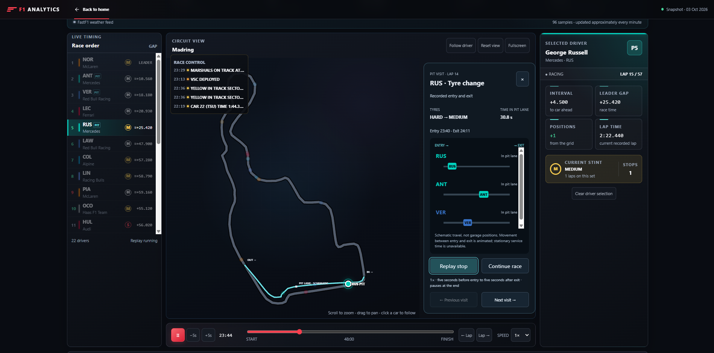
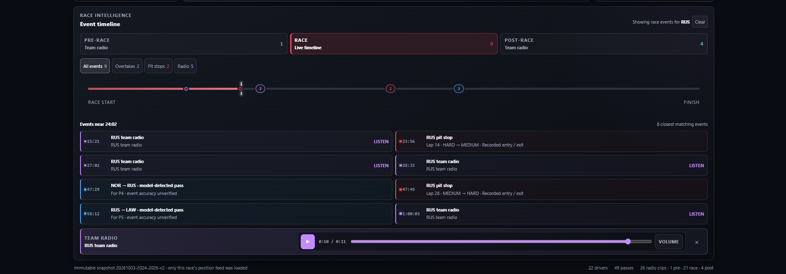
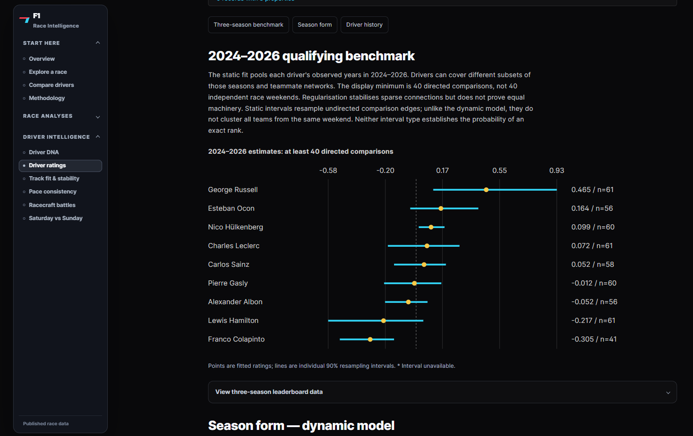
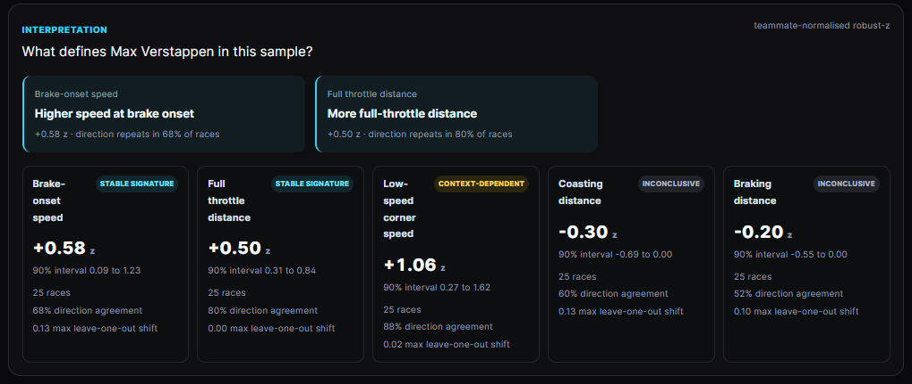
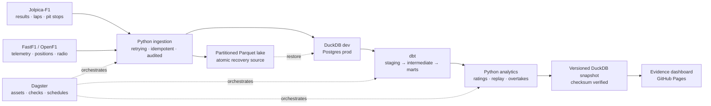

# F1 Data Analytics

Formula 1 results, timing and telemetry for the 2024–2026 seasons. This repository
contains the data pipeline, analytical models, an Evidence dashboard and a Svelte
race replay.

[](https://github.com/denzlswaggin/f1-data-analytics/actions/workflows/ci.yml)
[](warehouse/dbt)
[](orchestration)
[](dashboard)
[](LICENSE)

Python ingests the source data into Parquet and DuckDB or Postgres. dbt builds the
warehouse models; Dagster runs scheduled jobs. The dashboard reads a versioned
DuckDB snapshot rather than querying the working warehouse. The
[data-context guide](docs/data-context.md) describes how the 2024–2026 limit
applies to ingestion, models and snapshots.



*Madrid 2026 replay with the circuit, timing tower, pit stop and selected driver.*

## Race replay

The replay reconstructs the field from FastF1's time-stamped position feed.
Cars, timing gaps, tyres, race-control messages and available team radio use
the same race clock.

- Press play or scrub to any moment in the race.
- Select a driver to follow their car and filter the event timeline.
- Jump directly to a pass, incident or radio message.
- Review model-detected on-track passes. Pit-cycle swaps and brief timing-feed
  reversals are filtered out; pass accuracy has not been independently verified.
- See which races have complete enough position data for replay.



*The event timeline links passes, pit stops and radio messages to the replay clock.*

Position resampling and pass detection run before publication. The browser
animates the prepared data on a Svelte canvas. Snapshot counts appear below.

## Dashboard views

The dashboard has separate views for races, drivers, tyres and telemetry.

| View | What it shows |
| --- | --- |
| **Race cockpit** | Recorded result, eligible lap pace, pit windows and model-detected passes |
| **Race replay** | Car positions, timing, tyres, incidents and radio on one race clock |
| **Driver ratings** | Teammate-based qualifying estimates for 2024–2026, with intervals |
| **Driver comparison** | Shared-season estimates and the number of observations behind them |
| **Driver DNA** | Selected fast race laps compared with teammates, plus repeatability checks |
| **Telemetry** | Matched lap speed traces, estimated time delta and pedal inputs |
| **Tyre strategy** | Stint timelines and adjusted pace fall-off |
| **Pit strategy** | Stop duration, position changes and race-control context |
| **Saturday vs Sunday** | Race rating minus qualifying rating over matched seasons |

## Qualifying ratings

The qualifying model starts with teammate comparisons from the same car and
weekend. It uses the last qualifying segment completed by both drivers, then
combines the observed gaps in a connected teammate network.

A regularised least-squares fit produces the three-season ratings. Shrinkage
reduces the influence of thin samples. The static intervals resample teammate
comparison edges; season intervals resample whole weekends. Neither interval
gives the probability of an exact rank.



*Dashboard ratings with individual 90% intervals. This chart requires at least 40 directed comparisons per driver.*

The table below uses a lower cutoff of 20 directed comparisons, so it includes more
drivers than the dashboard chart. Values come from the 2024–2026 warehouse.

| Rank | Driver | Rating | Comparisons | Seasons |
| ---: | --- | ---: | ---: | --- |
| 1 | George Russell | 0.465 | 61 | 2024–2026 |
| 2 | Oliver Bearman | 0.273 | 37 | 2024–2026 |
| 3 | Andrea Kimi Antonelli | 0.164 | 37 | 2025–2026 |
| 4 | Esteban Ocon | 0.164 | 56 | 2024–2026 |
| 5 | Nico Hülkenberg | 0.099 | 60 | 2024–2026 |
| 6 | Charles Leclerc | 0.072 | 61 | 2024–2026 |
| 7 | Carlos Sainz | 0.052 | 58 | 2024–2026 |
| 8 | Pierre Gasly | -0.012 | 60 | 2024–2026 |
| 9 | Gabriel Bortoleto | -0.041 | 36 | 2025–2026 |
| 10 | Alexander Albon | -0.052 | 56 | 2024–2026 |

Ratings are relative to the observed teammate network. They are not lap-time
predictions, and the model cannot fully separate driver and car effects.
Connections between teammates, the season range and regularisation all affect
the ordering.

The earlier expanding-window evaluation used a wider dataset. It does not
validate predictions from the current 2024–2026 model.

Read the [validation report](docs/rating-validation.md) or reproduce the result:

```bash
python -m analytics.cli ratings --top 20
python -m analytics.cli ratings-v2 --top 20
python -m analytics.cli validate
```

## Driver DNA

Driver DNA compares representative fast race laps against each driver's teammate
and checks whether the differences repeat across races. The screenshot shows
Max Verstappen's 2025–2026 sample. It labels each trait as stable,
context-dependent or inconclusive based on the available laps.



These observations are limited to eligible fast laps. The
[Driver DNA validation protocol](docs/driver-dna-validation.md) explains the
matching rules and limits.

## Qualifying and race pace

The Saturday vs Sunday view compares qualifying and race ratings fitted over
the same seasons. For the race rating, teammates are paired on the same lap
number and tyre compound, at a similar tyre age, after filtering green-flag
laps.

```text
Saturday-to-Sunday delta = race rating − qualifying rating
```

Positive values mean the fitted race rating is higher. Read each difference
alongside its paired interval; a nonzero estimate can still be inconclusive.
The 2024–2026 relationship still needs fresh predictive validation. This
comparison does not isolate racecraft, strategy or reliability.

## Data pipeline

The diagram shows how source data reaches the dashboard. The repository also
keeps the raw partitions and model checks needed to rebuild a published result.



| Layer | Technology | Responsibility |
| --- | --- | --- |
| Sources | Jolpica-F1, FastF1, OpenF1 | Results, timing, telemetry, position, weather and radio |
| Ingestion | Python, Pydantic, Tenacity | Typed contracts, retries, incremental and idempotent loads |
| Lake | Partitioned Parquet | Atomic raw recovery by season, round and session |
| Warehouse | DuckDB / Postgres | Fast local development and persistent production storage |
| Transform | dbt | Tested staging, intermediate and mart models |
| Analytics | NumPy / pandas | Ratings, uncertainty, race replay and overtake detection |
| Orchestration | Dagster | Assets, schedules, freshness checks and targeted recovery |
| Serving | Evidence / Svelte | SQL-native analysis plus custom interactive components |

## Coverage and limits

The dashboard shows missing or ineligible data where a comparison cannot be
supported.

- Analysis pages report sample size, entities, race range and latest represented event.
- Driver ratings include uncertainty intervals and minimum-sample filters.
- Descriptive measures are labelled separately from model estimates.
- Replay coverage is checked against the race timing window before publication.
- Public pages read an immutable, checksum-verified DuckDB snapshot rather than the mutable warehouse.
- Late corrections rebuild only the affected race partition and propagate through downstream marts.

<!-- audit-statistics:start -->
Published snapshot: `20261003-2024-2026-v2`.

| Dataset | Observations | Races |
| --- | ---: | ---: |
| Lap timing | 62,470 | 62 |
| Telemetry | 754,175 | 60 |
| Replay | 6,290,491 | 61 |
<!-- audit-statistics:end -->

Regenerate these counts from the verified snapshot with
`python scripts/export_audit_evidence.py --update-readme`.
Dashboard builds regenerate the data shown in the app without editing README.

## Run it locally

### Requirements

- 64-bit Python 3.12
- Node.js 24 and npm 11 (see `.nvmrc`)
- GNU Make
- Docker only for the persistent Postgres/Dagster deployment

### Build a small local dataset

```bash
py -3.12 -m venv .venv
.venv\Scripts\activate
python -m pip install -r requirements-ci.lock
python -m pip install -e . --no-deps
copy .env.example .env

# Quick smoke dataset
python -m ingestion.cli backfill --season 2024
make dbt-build

# Analytical marts
python -m analytics.cli ratings
python -m analytics.cli ratings-v2

# Validate the rating and run the core project checks
python -m analytics.cli validate
make check
```

These commands build the results pipeline and driver ratings. The dashboard
also needs lap, telemetry and replay data. If you already have a prepared
`data/dashboard/latest.duckdb` snapshot, run `make setup` once and then
`make dashboard-dev`.

### Add telemetry and race replay

FastF1 is an optional dependency because the per-lap and positional feeds are much
heavier than the core results pipeline.

```bash
python -m pip install -e ".[telemetry]"
python -m ingestion.cli laps --season 2024
python -m ingestion.cli telemetry --season 2024
python -m ingestion.cli positions --season 2024
python -m ingestion.cli race-control --season 2024
python -m ingestion.cli team-radio --season 2024
make dbt-build
python -m analytics.cli pace-profile --from-season 2024
python -m analytics.cli replay --season 2024
python -m analytics.cli overtakes --season 2024
cd dashboard
npm ci
cd ..
make dashboard-dev
```

This starts both interfaces: Evidence on `http://localhost:3000` and the dedicated
race replay on `http://127.0.0.1:5173`. Opening **Watch the Race Unfold** in
Evidence redirects to the replay automatically. Press `Ctrl+C` once to stop both.

### Run the persistent stack

```bash
copy .env.production.example .env.production
# Replace the example password before starting the stack.
make prod-up
make prod-smoke
```

Postgres, Dagster history, the Parquet lake, FastF1 cache and compute logs persist
across restarts. The [production runbook](docs/production-runbook.md) covers health
checks, backups, incident triage and single-partition recovery.

## Repository map

```text
ingestion/        API clients, contracts, loaders and CLI
analytics/        rating models, validation, replay and overtake detection
warehouse/dbt/    staging, intermediate and mart models
orchestration/    Dagster assets, jobs, schedules and checks
dashboard/        Evidence pages and custom Svelte components
web/              SvelteKit race replay application
scripts/          snapshot, bundle and data-contract tooling
deploy/           container and guarded AWS infrastructure templates
tests/            unit, integration and regression coverage
docs/             model reports, case study, codebase guide and runbooks
```

## Checks

CI runs:

- Ruff formatting and linting
- strict mypy type checking
- pytest with coverage
- SQLFluff and dbt data/unit tests
- DuckDB and Postgres compatibility
- Dagster definition validation
- incremental-correction regression tests
- dashboard data-contract checks and strict Evidence build
- bundle-size budget and snapshot checksum verification

Run the core local suite with:

```bash
make check
make dbt-build
```

## Documentation

- [2024–2026 data context](docs/data-context.md)
- [How the codebase fits together](docs/codebase-guide.md)
- [Portfolio case study](docs/portfolio-case-study.md)
- [Teammate-normalised pace: the full story](docs/blog-teammate-normalised-pace.md)
- [Driver-rating validation](docs/rating-validation.md)
- [Dynamic season model](docs/dynamic-rating-model.md)
- [Joint ratings V3 experiment](docs/ratings-v3-experiment.md)
- [Versioned dashboard snapshots](docs/dashboard-snapshots.md)
- [Production runbook](docs/production-runbook.md)
- [Five-minute interview walkthrough](docs/interview-walkthrough.md)

## Data and licence

Code is released under the [MIT License](LICENSE). Formula 1 data comes from
[Jolpica-F1](https://github.com/jolpica/jolpica-f1),
[FastF1](https://github.com/theOehrly/Fast-F1) and
[OpenF1](https://openf1.org). This is an independent, non-commercial analytical
project and is not affiliated with Formula 1, its teams or its commercial rights holders.
