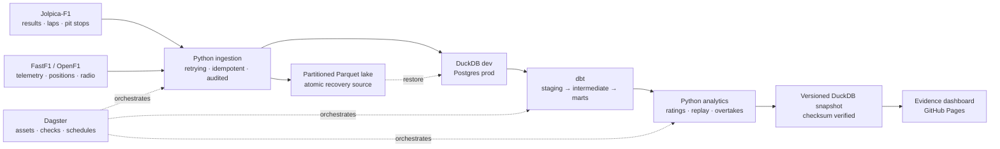

# F1 Analytics — See Beyond the Result

> Results tell you **what happened**. This project uses timing, telemetry, strategy,
> teammate comparisons and race reconstruction to help explain **why**.

[](https://github.com/denzlswaggin/f1-data-analytics/actions/workflows/ci.yml)
[](warehouse/dbt)
[](orchestration)
[](dashboard)
[](LICENSE)

An end-to-end Formula 1 data product: resilient Python ingestion, a recoverable
Parquet lake, DuckDB and Postgres warehouses, tested dbt transformations, Dagster
orchestration, reproducible analytical models and an interactive Evidence dashboard.

<!--
Launch asset: add a real 8–12 second Race Replay GIF here before announcing the
public repository. Suggested path: docs/readme-assets/race-replay.gif

After the first Pages deployment, also add:
**[Explore the live dashboard →](https://denzlswaggin.github.io/f1-data-analytics/)**
-->

## Watch a race unfold

The headline experience is a full-field race replay reconstructed from FastF1's
time-stamped positional feed. Every car runs on one shared clock while the timing
tower, gaps, lap and tyre detail, race-control messages, detected overtakes and
available team radio stay in sync.

- Press play or scrub to any moment in the race.
- Select a driver to follow their car and filter the event timeline.
- Jump directly to a pass, incident or radio message.
- See confidence-scored on-track overtakes without pit-cycle swaps and timing-feed flicker.
- Withhold incomplete position feeds instead of presenting a partial race as complete.

The browser animates a purpose-built replay mart with **4.1 million car ticks** in
the current snapshot. A custom Svelte canvas keeps the experience responsive; the
heavy resampling and pass detection happen once upstream, not in every visitor's browser.

## Explore by question

The dashboard is organised around questions rather than warehouse tables.

| Question | Dashboard view | What it adds |
| --- | --- | --- |
| What actually decided the race? | **Latest race story** | Controlled pace, execution gain and detected passes |
| Can I watch the race develop? | **Race replay** | Cars, timing, tyres, incidents, overtakes and radio on one clock |
| Who is fastest beyond the car? | **Driver ratings** | Teammate-normalised career pace and current form |
| How do two drivers compare? | **Driver comparison** | Shared-season form, 90% intervals and an evidence-strength cue |
| Where was a lap won? | **Telemetry** | Speed traces, cumulative time delta and pedal inputs |
| Which tyres faded? | **Tyre strategy** | Stint timelines and fuel- and track-adjusted fall-off |
| Which pit cycles changed the race? | **Pit strategy** | Stop speed, position swing and race-control context |
| Who gains on Sunday? | **Saturday vs Sunday** | Race rating minus qualifying rating over matched seasons |

## The signature insight — pace beyond the car

Championship points combine driver skill, car strength, reliability and strategy.
This project reduces the largest shared confounder by comparing **teammates in the
same machinery**.

For each qualifying session, the last segment completed by both teammates becomes a
direct pace comparison. Those gaps form a connected teammate graph, which is solved
into one cross-era leaderboard with a Massey-style least-squares fit. Empirical-Bayes
shrinkage stops thin samples from dominating, while a race-weekend cluster bootstrap
makes uncertainty visible.

**Fastest qualifiers, 2006–2026** — drivers with at least 40 head-to-heads:

| Global rank | Driver | Rating | Head-to-heads | Seasons |
| ---: | --- | ---: | ---: | --- |
| 1 | Max Verstappen | 0.919 | 234 | 2015–2026 |
| 4 | George Russell | 0.619 | 161 | 2019–2026 |
| 5 | Charles Leclerc | 0.559 | 183 | 2018–2026 |
| 6 | Daniel Ricciardo | 0.495 | 252 | 2011–2024 |
| 7 | Sebastian Vettel | 0.462 | 292 | 2007–2022 |
| 8 | Pierre Gasly | 0.435 | 181 | 2017–2026 |
| 9 | Lando Norris | 0.433 | 162 | 2019–2026 |
| 12 | Nico Rosberg | 0.345 | 202 | 2006–2016 |
| 14 | Fernando Alonso | 0.293 | 358 | 2006–2026 |
| 15 | Lewis Hamilton | 0.288 | 388 | 2007–2026 |

These are relative teammate margins, not a GOAT list or an absolute lap-time
prediction. Global-rank gaps belong to lower-sample drivers omitted by the filter.
Hamilton's position is a useful illustration of the metric: Alonso, Rosberg and
Russell are unusually strong benchmarks, so beating the teammate baseline is harder.

The claim is tested rather than assumed. In expanding-window evaluation, the static
rating picks the winner of an unseen individual qualifying comparison **60.5%** of the
time and the winner of a season-long teammate battle **68.0%** of the time. It does not
predict the exact single-session gap better than a zero-gap baseline, so the product
presents it as a ranking and states that limit explicitly.

Read the [validation report](docs/rating-validation.md) or reproduce the result:

```bash
python -m analytics.cli ratings --top 20
python -m analytics.cli ratings-v2 --top 20
python -m analytics.cli validate
```

## The second cut — Saturday vs Sunday

Qualifying measures one clean lap. Race pace adds fuel, traffic, tyre management and
strategy. To keep the comparison fair, teammates are paired on the **same lap number**,
on the **same compound**, at a similar tyre age, over filtered green-flag laps. Both
ratings are fitted over the same seasons.

```text
Saturday-to-Sunday delta = race rating − qualifying rating
```

Positive means a driver's relative margin improves on Sunday; negative means their
advantage is stronger on Saturday. The two ratings have a Spearman correlation of
**0.65** in the current ground-effect-era sample: related, but far from duplicates.
The dashboard treats this as a comparison signal, not proof of racecraft or a causal
measure of strategy and reliability.

## One pipeline, two audiences

An F1 fan can explore drivers, races, telemetry and strategy. A data team can inspect
the lineage, coverage, tests and recovery path behind every published number.



| Layer | Technology | Responsibility |
| --- | --- | --- |
| Sources | Jolpica-F1, FastF1, OpenF1 | Results, timing, telemetry, position, weather and radio |
| Ingestion | Python, Pydantic, Tenacity | Typed contracts, retries, incremental and idempotent loads |
| Lake | Partitioned Parquet | Atomic raw recovery by season, round and session |
| Warehouse | DuckDB / Postgres | Fast local development and persistent production storage |
| Transform | dbt | Tested staging, intermediate and mart models |
| Analytics | NumPy / pandas | Ratings, uncertainty, race replay and overtake detection |
| Orchestration | Dagster | Assets, schedules, freshness checks and targeted recovery |
| Serving | Evidence / Svelte | SQL-native analysis plus custom interactive components |

## Trust is part of the interface

The dashboard does not silently turn missing data into zeroes or confident claims.

- Every section publishes sample size, entities, race range and latest represented event.
- Driver ratings include uncertainty intervals and minimum-sample filters.
- Descriptive metrics are labelled as descriptive; causal language is avoided.
- Replay coverage is checked against the race timing window before publication.
- Public pages read an immutable, checksum-verified DuckDB snapshot rather than the mutable warehouse.
- Late corrections rebuild only the affected race partition and propagate through downstream marts.

The current local dataset spans **411 race weekends**, **103 drivers**, **8,424 directed
qualifying comparisons**, **613,680 telemetry rows** and more than **4.1 million replay
ticks**. Coverage is intentionally uneven for heavier telemetry sources and is exposed
in the product rather than hidden.

## Run it locally

### Requirements

- 64-bit Python 3.12
- Node.js 24 and npm 11 (see `.nvmrc`)
- GNU Make
- Docker only for the persistent Postgres/Dagster deployment

### Build a small local dataset

```bash
py -3.12 -m venv .venv
.venv\Scripts\activate
python -m pip install -r requirements-ci.lock
python -m pip install -e . --no-deps
copy .env.example .env

# Quick smoke dataset
python -m ingestion.cli backfill --season 2023
make dbt-build

# Analytical marts
python -m analytics.cli ratings
python -m analytics.cli ratings-v2

# Validate the rating and run the core project checks
python -m analytics.cli validate
make check
```

This is enough to exercise the core ingestion, transformation and rating pipeline.
The complete dashboard also expects the heavier lap, telemetry and replay sources
below. If you already have a prepared `data/dashboard/latest.duckdb` snapshot, run
`make setup` once and then `make dashboard-dev`.

### Add telemetry and race replay

FastF1 is an optional dependency because the per-lap and positional feeds are much
heavier than the core results pipeline.

```bash
python -m pip install -e ".[telemetry]"
python -m ingestion.cli laps --season 2024
python -m ingestion.cli telemetry --season 2024
python -m ingestion.cli positions --season 2024
python -m ingestion.cli race-control --season 2024
python -m ingestion.cli team-radio --season 2024
make dbt-build
python -m analytics.cli pace-profile --from-season 2024
python -m analytics.cli replay --season 2024
python -m analytics.cli overtakes --season 2024
cd dashboard
npm ci
cd ..
make dashboard-dev
```

This starts both interfaces: Evidence on `http://localhost:3000` and the dedicated
race replay on `http://127.0.0.1:5173`. Opening **Watch the Race Unfold** in
Evidence redirects to the replay automatically. Press `Ctrl+C` once to stop both.

### Run the persistent stack

```bash
copy .env.production.example .env.production
# Replace the example password before starting the stack.
make prod-up
make prod-smoke
```

Postgres, Dagster history, the Parquet lake, FastF1 cache and compute logs persist
across restarts. The [production runbook](docs/production-runbook.md) covers health
checks, backups, incident triage and single-partition recovery.

## Repository map

```text
ingestion/        API clients, contracts, loaders and CLI
analytics/        rating models, validation, replay and overtake detection
warehouse/dbt/    staging, intermediate and mart models
orchestration/    Dagster assets, jobs, schedules and checks
dashboard/        Evidence pages and custom Svelte components
web/              SvelteKit race replay application
scripts/          snapshot, bundle and data-contract tooling
deploy/           container and guarded AWS infrastructure templates
tests/            unit, integration and regression coverage
docs/             model reports, case study, codebase guide and runbooks
```

## Quality gates

Changes are checked across the whole product, not only the Python package:

- Ruff formatting and linting
- strict mypy type checking
- pytest with coverage
- SQLFluff and dbt data/unit tests
- DuckDB and Postgres compatibility
- Dagster definition validation
- incremental-correction regression tests
- dashboard data-contract checks and strict Evidence build
- bundle-size budget and snapshot checksum verification

Run the core local suite with:

```bash
make check
make dbt-build
```

## Deeper documentation

- [How the codebase fits together](docs/codebase-guide.md)
- [Portfolio case study](docs/portfolio-case-study.md)
- [Teammate-normalised pace: the full story](docs/blog-teammate-normalised-pace.md)
- [Driver-rating validation](docs/rating-validation.md)
- [Dynamic season model](docs/dynamic-rating-model.md)
- [Joint ratings V3 experiment](docs/ratings-v3-experiment.md)
- [Versioned dashboard snapshots](docs/dashboard-snapshots.md)
- [Production runbook](docs/production-runbook.md)
- [Five-minute interview walkthrough](docs/interview-walkthrough.md)

## Data and licence

Code is released under the [MIT License](LICENSE). Formula 1 data comes from
[Jolpica-F1](https://github.com/jolpica/jolpica-f1),
[FastF1](https://github.com/theOehrly/Fast-F1) and
[OpenF1](https://openf1.org). This is an independent, non-commercial analytical
project and is not affiliated with Formula 1, its teams or its commercial rights holders.
