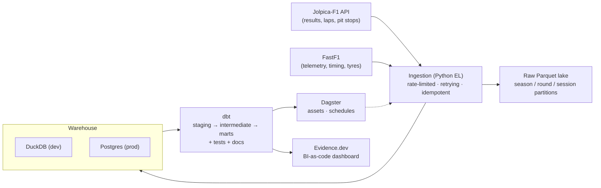

# F1 Analytics Engineering Platform

> An end-to-end **data engineering** platform for Formula 1: reliable ingestion,
> a versioned warehouse, tested transformations, orchestration, and a
> SQL-native dashboard — powering a signature insight that isolates **driver
> skill from car performance**.

[](https://github.com/denzlswaggin/f1-data-analytics/actions/workflows/ci.yml)
[](warehouse/dbt)
[](orchestration)

---

## The signature insight — "true pace" driver ratings

Teammates drive **identical machinery**, so the qualifying gap *between teammates*
isolates driver skill from the car. Each gap is turned into an additive log-pace
difference and the whole set is solved into one cross-era leaderboard via a
Massey-style least-squares fit on the teammate graph (with empirical-Bayes
shrinkage so thin-sample drivers don't top the board on noise).

**Fastest qualifiers, 2006–2025** (teammate-normalised, drivers with ≥40 head-to-heads):

| Rank\* | Driver           | Rating | Head-to-heads | Seasons   |
| -----: | ---------------- | -----: | ------------: | --------- |
|      1 | Max Verstappen   |  0.946 |           224 | 2015–2025 |
|      4 | George Russell   |  0.641 |           149 | 2019–2025 |
|      5 | Charles Leclerc  |  0.578 |           171 | 2018–2025 |
|      6 | Daniel Ricciardo |  0.504 |           252 | 2011–2024 |
|      7 | Sebastian Vettel |  0.469 |           292 | 2007–2022 |
|      8 | Pierre Gasly     |  0.441 |           169 | 2017–2025 |
|      9 | Lando Norris     |  0.438 |           150 | 2019–2025 |
|     11 | Nico Rosberg     |  0.351 |           202 | 2006–2016 |
|     14 | Fernando Alonso  |  0.300 |           347 | 2006–2025 |
|     15 | Lewis Hamilton   |  0.295 |           376 | 2007–2025 |

\* Global rank across all 100 drivers; the gaps (2, 3, 10, …) are lower-sample
drivers omitted from this filtered view. Higher rating = faster vs teammates.
Hamilton mid-pack is a genuinely debatable result — the metric measures *margin
over teammate*, and his teammates (Alonso, Rosberg, Russell) were consistently
strong.

Reproduce:

```bash
pip install -e ".[dbt]"                                  # dbt is a separate extra (see below)
python -m ingestion.cli backfill --from 2006 --to 2025   # ~17k rows
make dbt-build                                           # staging → intermediate → marts
python -m analytics.cli ratings --top 20                 # solve + print leaderboard
python -m analytics.cli ratings-v2 --top 20              # season-specific form + intervals
```

The V2 model adds one rating per driver-season, temporal smoothing between
seasons, Q1/Q2/Q3 reliability weights, and a race-weekend cluster bootstrap. It
is kept alongside the career-wide model because its expanding-window gain is
small (MAE 0.643 vs 0.645; sign accuracy 0.609 vs 0.606 on the current
2006–2025 dataset), while its main value is showing form changes honestly.

## The second cut — Saturday vs Sunday

Qualifying is one clean lap: no traffic, no fuel, no tyre management. It says who is
fastest on Saturday and nothing about Sunday. So the same teammate-normalisation is
applied to **race** pace, and the two ratings are set against each other.

Race laps are only a fair comparison when they are alike, so teammates are paired on
the **same lap number** — identical fuel load — over green-flag laps on the **same
compound** at a similar tyre age, with the start lap, in/out laps and outliers dropped.
Those per-race gaps go through the *same* least-squares solver, and:

```
delta = race rating − qualifying rating
```

Positive = gains ground on the field once the race starts; negative = flatters to
deceive on Saturday. Both ratings are fitted over the **same seasons**, so the
comparison is like-for-like, and both are relative to the field — a delta of zero means
"improves on Sunday exactly as much as the average driver does", not "no improvement".

Race pace needs FastF1 per-lap timing (2018+), so this runs over a narrower window than
the qualifying leaderboard, bounded to one set of technical regulations.

**2022–2025** (ground-effect era; 1,190 teammate race gaps over 92 races, averaging 28.7
comparable laps each):

| Driver          |  Delta | Quali  |  Race  | Races |
| --------------- | -----: | -----: | -----: | ----: |
| Logan Sargeant  | +1.048 | −1.185 | −0.137 |    26 |
| Sergio Pérez    | +0.901 | −0.715 | +0.186 |    51 |
| Lewis Hamilton  | +0.091 | −0.058 | +0.033 |    64 |
| …               |        |        |        |       |
| Esteban Ocon    | −0.129 | +0.131 | +0.002 |    56 |
| Max Verstappen  | −0.145 | +0.796 | +0.651 |    66 |
| Fernando Alonso | −0.164 | +0.357 | +0.192 |    56 |
| Carlos Sainz    | −0.180 | +0.269 | +0.089 |    66 |
| Yuki Tsunoda    | −0.244 | +0.066 | −0.178 |    55 |
| Alexander Albon | −0.280 | +0.420 | +0.140 |    53 |
| George Russell  | −0.324 | +0.361 | +0.037 |    68 |

Drivers with fewer than ~25 comparable races are omitted here — the solver shrinks them
toward the field mean, but a thin sample still deserves a caveat rather than a headline.

The two biggest "racers" are exactly the drivers whose qualifying was demolished by a
dominant teammate and who recovered on Sunday. Verstappen reads as a mild qualifying
specialist not because his race pace is poor — it is the best in the field — but because
his *margin* over a teammate shrinks from Saturday to Sunday.

Spearman between the two ratings is **0.68** — strongly positive, but far enough from 1
that the delta is carrying real information rather than restating the qualifying rating.

Reproduce:

```bash
python -m ingestion.cli laps --season 2024               # FastF1 laps (.[telemetry])
make dbt-build
python -m analytics.cli pace-profile --from-season 2022  # racers vs qualifying specialists
```

## Architecture



## Tech stack

| Layer          | Tool                                             |
| -------------- | ------------------------------------------------ |
| Sources        | [Jolpica-F1](https://github.com/jolpica/jolpica-f1) (post-Ergast) · [FastF1](https://github.com/theOehrly/Fast-F1) |
| Ingestion      | Python, `requests`, `tenacity`, `pydantic`       |
| Lake           | Parquet (`pyarrow`)                              |
| Warehouse      | DuckDB (dev) · Postgres (prod, docker-compose)   |
| Transform      | dbt (`dbt-duckdb`, `dbt-postgres`)               |
| Orchestration  | Dagster                                          |
| Serving        | Evidence.dev                                     |
| Quality / CI   | `ruff`, `mypy`, `pytest`, `sqlfluff`, GitHub Actions |

## Quickstart

```bash
# 1. Create a 64-bit Python 3.12 virtual environment
py -3.12 -m venv .venv
.venv\Scripts\activate           # Windows PowerShell
pip install -e ".[dev]"

# 2. Configure
copy .env.example .env           # then edit as needed

# 3. Backfill a single season into the local DuckDB warehouse (quick smoke test;
#    the full driver-ratings dataset is the 2006–2025 backfill shown above)
python -m ingestion.cli backfill --season 2023

# 4. (Optional) run the persistent Postgres + Dagster stack
cp .env.production.example .env.production  # replace the password
make prod-up
make prod-smoke
```

## Repository layout

```
ingestion/        Python EL package (clients, loaders, CLI)
warehouse/dbt/    dbt project (staging → intermediate → marts)
orchestration/    Dagster assets, jobs, schedules
dashboard/        Evidence.dev BI-as-code project
tests/            pytest suite
```

## Container & reproducibility

```bash
# Run the whole pipeline in a container (ingestion + dbt + analytics):
docker build -t f1-platform .
docker run --rm f1-platform backfill --season 2024              # ingestion CLI
docker run --rm --entrypoint f1-analytics f1-platform ratings   # analytics CLI

pip install -r requirements.lock   # pinned core runtime (regenerate: make lock)
```

The Parquet lake is storage-agnostic: set `F1_LAKE_URI=s3://your-bucket/f1-lake`
(with `pip install -e ".[cloud]"` and AWS creds in the environment) to write it to
object storage instead of local disk — the ingestion code is unchanged.

The Compose deployment keeps the warehouse, Dagster run history, Parquet lake,
FastF1 cache, and compute logs across restarts. See the
[production runbook](docs/production-runbook.md) for health checks, backups, and
single-partition recovery. Maintainers should also apply the documented
[repository protection settings](docs/repository-settings.md); rulesets are
GitHub-side configuration and are not automatically enabled by cloning this
repository. A guarded [AWS Terraform data-plane template](deploy/terraform/aws)
is available for private RDS and a versioned S3 lake; it must be reviewed and
applied by an operator with an encrypted remote state backend.

The public dashboard is built from a checksum-verified, immutable DuckDB export,
not from the mutable warehouse or an API backfill inside the Pages job. Build a
local snapshot with `make dashboard-snapshot`; production publishes the same
artifact to versioned object storage with
`python scripts/dashboard_snapshot.py build --publish-uri s3://...`. See
[versioned dashboard snapshots](docs/dashboard-snapshots.md) for the object
contract and rollback procedure.

## Roadmap

- [x] **M1 — Foundations**: scaffold, ingestion, warehouse, CI
- [x] **M2 — dbt core**: staging/intermediate/marts + `driver_ratings` insight
- [x] **M3 — Telemetry & serving**: FastF1 ingestion + Evidence dashboard + Pages deploy
- [x] **M4 — Orchestration**: Dagster assets + race-weekend schedule
- [x] **M5 — Depth**: tyre-degradation mart, drivers snapshot, prod indexes, writeup

## Writeup

- [The full story](docs/blog-teammate-normalised-pace.md) — method, results, and the stack behind them
- [Portfolio case study](docs/portfolio-case-study.md) — problem, decisions, evidence, trade-offs
- [Validating the rating model](docs/rating-validation.md) — backtest, shrinkage sensitivity, bootstrap CIs
- [Dynamic rating V2](docs/dynamic-rating-model.md) — driver-season form and clustered uncertainty
- [Interview walkthrough](docs/interview-walkthrough.md) — a five-minute technical tour
- [LinkedIn draft](docs/linkedin-post.md)
- [Production runbook](docs/production-runbook.md) — deploy, monitor, recover, restore

## License

MIT — see [LICENSE](LICENSE). Not affiliated with Formula 1. Data via Jolpica-F1
and FastF1; F1 timing data © FOM, used here for non-commercial analysis.
