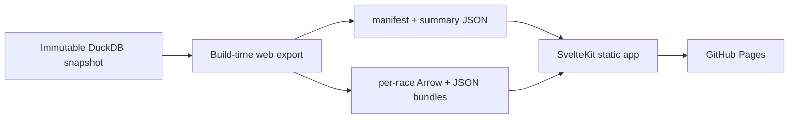

# SvelteKit dashboard proof of concept

## Decision to test

Replace only the Evidence presentation layer with a purpose-built SvelteKit
application. Keep ingestion, the Parquet lake, DuckDB/Postgres, dbt, analytical
models, Dagster orchestration and the immutable snapshot contract unchanged.

The proof of concept should answer one question before a full migration begins:

> Does a dedicated frontend make the race replay feel like a polished F1 product
> without weakening reproducibility, static hosting or data trust?

Evidence remains the working dashboard until the proof of concept passes the
decision gate below.

## Product slice

The first slice is intentionally narrow. It contains:

1. A compact application shell and navigation.
2. A full-viewport race replay as the primary route.
3. Season and race selection.
4. Circuit map, timing tower, replay controls and driver detail.
5. A unified event timeline for race control, overtakes and team radio.
6. Loading, empty, incomplete-feed and audio-error states.
7. One small landing route that links directly into the replay.

Driver ratings, telemetry, strategy and methodology pages are migration candidates,
not proof-of-concept requirements. They stay in Evidence during the first slice.

## Experience direction

The replay should look like a race-control product rather than a report embedded in
a Markdown page.

- Dark graphite surfaces with restrained team-colour accents.
- Dense, broadcast-inspired information hierarchy without copying official F1 branding.
- Track map as the dominant surface in the first viewport.
- Persistent timing tower and selected-driver panel on desktop.
- Timeline and playback controls spanning the available width.
- Clear tyre, position, gap, flag, overtake-confidence and radio states.
- Fullscreen, keyboard and touch interaction treated as first-class paths.
- Responsive layouts that become map-first tabs or stacked panels on narrow screens.
- Motion limited to meaningful replay, selection and status transitions.

## Proposed architecture



The browser should not download or query the complete dashboard database. A build
step will publish route-specific assets:

```text
web/static/data/
├── manifest.json
├── latest-race.json
├── ratings-summary.json
└── races/
    └── 2026-11/
        ├── replay.arrow
        ├── laps.json
        ├── meta.json
        ├── overtakes.json
        ├── race-control.json
        └── radio.json
```

Small datasets use JSON. High-volume replay positions use Arrow IPC or an equivalent
typed binary representation. Only the selected race bundle is loaded. The exporter
must read the same checksum-verified snapshot used by Evidence and fail on missing or
invalid contracts.

DuckDB-Wasm remains an option for later exploratory SQL, but it is not required for
the first replay slice.

## Repository layout

```text
web/                         new SvelteKit application
web/src/lib/components/      replay and shared UI components
web/src/lib/data/            loaders, schemas and view models
web/src/routes/              landing and replay routes
web/static/data/             generated, ignored local assets
scripts/export_web_data.py   snapshot-to-web export
tests/                       exporter and data-contract tests
dashboard/                   existing Evidence app during migration
```

Existing Svelte replay components should be moved or adapted deliberately rather
than copied indefinitely. During the proof of concept, a temporary copy is acceptable;
before full migration there must be one canonical implementation.

## Implementation phases

### Phase 0 — preserve the baseline

- Keep the existing Evidence build deployable.
- Retain the current replay radio and selected-driver filtering fixes.
- Record current replay payload size, first-load time and animation behaviour.
- Select one representative race with overtakes, race control and available radio.

### Phase 1 — scaffold and visual shell

- Create `web/` with SvelteKit, TypeScript and the static adapter.
- Configure the `/f1-data-analytics` base path for GitHub Pages.
- Add design tokens, typography, application shell and responsive layout.
- Render a representative static replay state before wiring the full dataset.

### Phase 2 — web data contract

- Implement the snapshot exporter and manifest.
- Split replay data by season and round.
- Preserve driver codes, team colours, lap context, overtakes, race control and radio URLs.
- Validate row counts, replay duration, race coverage and required fields.
- Add deterministic output and payload-size checks.

### Phase 3 — functional replay

- Port the track canvas and animation clock.
- Port the timing tower and selected-driver detail.
- Port zoom, pan, follow camera, scrub, speed and lap navigation.
- Port event filtering with an explicit selected-driver state.
- Add persistent native radio controls, playback feedback and source-error handling.
- Load race bundles on demand and cancel stale requests when selection changes.

### Phase 4 — polish and verification

- Add loading, empty, partial-data and error states.
- Verify keyboard navigation, focus order, colour contrast and reduced motion.
- Test desktop, tablet and mobile layouts.
- Add component tests for filters and replay state plus an end-to-end happy path.
- Build the static site and enforce a bundle/payload budget.

### Phase 5 — migration decision

Compare the SvelteKit slice with Evidence using the decision gate. If it passes,
migrate the landing page, driver ratings and driver comparison next. Strategy,
telemetry and methodology follow only after the shared chart and table primitives
are stable.

## Proof-of-concept acceptance criteria

The slice passes when all of the following are true:

- The first viewport exposes the map, timing tower and playback controls without report chrome.
- A race can be selected, loaded and replayed from a static GitHub Pages build.
- Selecting a driver filters radio and overtakes and updates the driver panel immediately.
- Clicking a radio event seeks to its timestamp and exposes working native audio controls.
- Race-control, overtake and radio markers remain synchronized while scrubbing and playing.
- The page loads only the selected race's high-volume position data.
- Incomplete replay feeds produce an explicit unavailable state.
- Desktop interaction stays visually smooth with a full field of cars.
- The route works with keyboard controls and at a narrow mobile viewport.
- Unit/component tests, the production build and the existing data-contract checks pass.

## Decision gate for replacing Evidence

Proceed with the full migration only if:

1. The replay is visibly stronger and easier to understand.
2. Feature parity does not require duplicating analytical business logic in TypeScript.
3. Static deployment and immutable snapshot guarantees remain intact.
4. Per-race loading materially improves initial payload and interaction performance.
5. The new frontend is maintainable without keeping two permanent component implementations.

If those conditions are not met, keep Evidence for analytical pages and publish the
SvelteKit replay as a focused companion application instead of forcing a full rewrite.

## Explicit non-goals

- Rewriting ingestion, dbt, Dagster or the analytical models.
- Adding a live API or user authentication.
- Streaming live races.
- Reproducing Formula 1's trademarks or broadcast graphics.
- Migrating every dashboard page before the replay proof of concept is evaluated.
